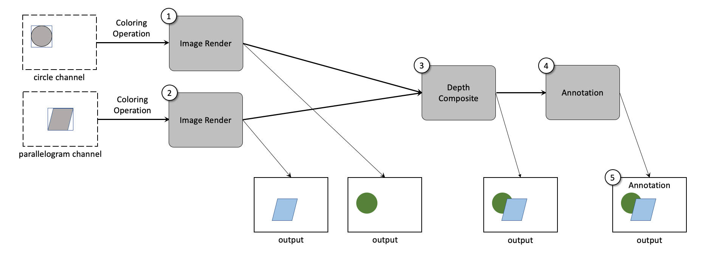

# CIS image proposal

This is a draft proposal for a redesign of the Cinema Image Set specification.

## The Cinema Image Set (CIS) Specification

A CIS database is a logical collection of related images.

A single CIS image is the result of coloring and compositing a set of elements together. The results of the coloring and compositing steps are dependent upon the information contained in the CIS file, choices by the user, and the capabilities of the **consumer** application.

<table>
<tr>
<td></img></td>
<tr>
<td>
Diagram of how a Cinema Compositable Image Set will be rendered using Cinema 2.0 filters. Image Render Filters (1,2), take in channel data and render images. A Depth Composite Filter (3), performs a depth composite on its input images, and an Annotation Filter (4) adds annotation to an image. The results of all of these filter operations is a single output image (5).
</td>
</tr>
</table>

- **image** 
    - required: (width, height) [int, int]
    - required: origin (0,0) point 
        - default is ll 
    - required: 0 or more **layers**
    - required: 0 or more **images** 

- **layer**
    - required: name [string]
        - reserved names include [depth, shadow]
        - depth: depth value for layer
        - shadow: shadow value for layer
    - required: (width, height) [int, int]
    - required: (x,y) [int, int] offset from its image's origin
        - when offset, the layer's contents may be outside the image's (w,h)

**NOTE** a layer could also be defined as an image OR a set of re-colorable, compositable data.

# Example

- **image**
    - **layer**
        - name: overlay
        - layer: overlay
    - **layer**
        - name: background
        - layer: background
    - **image**
        - name: circle
        - layer: depth
        - layer: shadow
        - layer: density
        - layer: pressure
        - layer: temperature
    - **image**
        - name: paralelleogram
        - layer: depth
        - layer: shadow
        - layer: density
        - layer: pressure
        - layer: temperature
