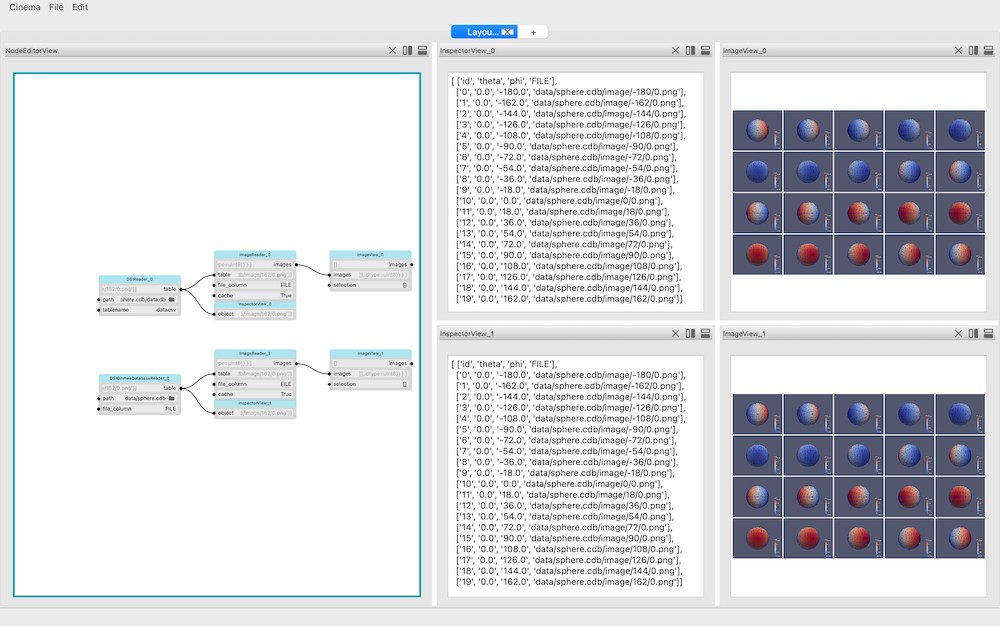

# DSI implementation notes

||
| ---- |
|*Screen capture of DSIReader and DSICinemaDatabaseReader filters, showing them reading data converted from data.csv file to a data.db file, within a cinema database.*|

There are two DSI readers:

- **DSIReader** reads a database file and returns a table. It makes no assumptions about what is in the database.
- **DSICinemaDatabaseReader** looks for a *data.db* file when given a path to a cinema database. Assumptions are that the *data.db* was exported with the **ExportTableToDatabase**  filter attached to a **CinemaDatabaseReader** filter. The result is that an *id* column has already been created, and the database path has been added to the paths in the *FILE* column. This means that if the database is moved, the **DSICinemaDatabaseReader** will no longer be able to find the image files. A re-export of the cinema database will fix this, but it is not automatic. 

To exercise the DSI capabilities, we create a database in a new scratch area, export a database from the *data.csv* file in the cinema database, and then view the DSI database with a set of filters:

```
python examples/dsi/DSITestCreate.py
cinema examples/dsi/DSIExample.py

rm -rf DSIscratch
```
