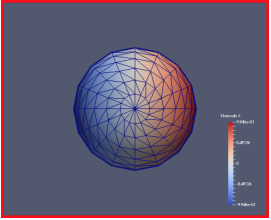

# Examples using Binder (jupyter notebooks)

These are examples of Cinema Engine pipelines. Click on the image to start a virtual machine running the example.

<table>
<tr>
<td style="text-align:center;">Sphere</td>
</tr>
<tr>
<td>
    <a href="https://mybinder.org/v2/gh/cinemascience/pycinema_binder/HEAD?labpath=sphere.ipynb">
        </img>
    </a>
</td>
</tr>
</table>

