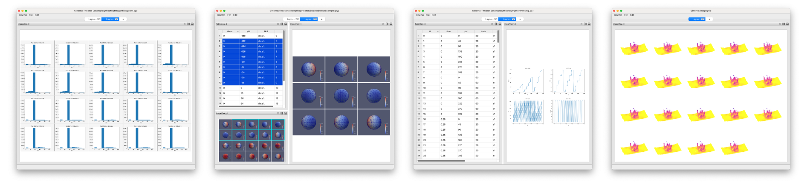

# Release procedure

Releasing pycinema is a combination of automatic testing, user testing and module testing.
For general development, the dev branch is merged into `master` and then a release is created. 

All testing should be done first on the feature-complete `dev` branch. Once this is complete,
`dev` can be merged with `master`, and the release can be made from `master`.

## CI testing

CI testing is automatically executed with github actions. These should be adjusted per the capabilities
in the release. In general, all checkins to `dev` should be verified to not break any existing tests.
In addition, the versions of OS and python should be checked to cover current supported releases.

## User/hand testing

||
| ---- |
|*Screen captures of some of the examples that should be run to test a release of pycinema. From left to right: examples/theater/ImageHistogram.py, examples/theater/SubsetSelectExample.py, examples/theater/PythonPlotting.py, examples/recolor/asteroid.py (viewed with `cinema imagegrid`)*|

Testing of examples and interactive `cinema` execution is done by hand in two steps:

1. Run `cinema` viewer subcommands on the datasets in `data/` subdirectory. Some subcommands
   support `rgb` databases, some support `hdf5` databases, and some support both. The `cinema --help`
   command will report which databases are supported by which subcommands. Some example tests include:

```
    cinema explore data/asteroid_scalar_images.cdb
    cinema imagegrid data/sphere.cdb
```

2. Run the relevant example scripts in `examples/` directory. Note that `cinema compose` takes
   a configuration file (yaml) as an argument. This file defines input, output and other settings.

- `examples/compose` these test the `compose` subcommand
```
    cinema examples/compose/<name of configuration file>    tests `compose` subcommand
```

- `examples/dsi` these test `DSI`-related capability and are currently automatically
  run under github actions, so they do not need to be run by hand. 

- `examples/ipynb` these test python notebook capability, and are deprecated 

- `examples/python` these test python capability (they do not need the **Theater** application,
  and are currently automatically run under github actions, so they do not need to be run by hand.

- `examples/pythonfilter` these are scripts run by the `Python` filter, and are
  used by other examples or tests. They do not need to be run by hand.

- `examples/recolor` these test the `recolor` subcommand. Run the command and then view the 
  results with `imagegrid`. Note that `cinema recolor` takes a configuration (yaml) file as
  an argument. This file defines the input, output and other settings.

```
    cinema recolor examples/recolor/<name of configuration file>
    cinema imagegrid <result directory as reported by script>
```

- `examples/theater` these are examples that run scripts and bring up the theater interactive application.

```
   cinema examples/theater/<name of script>     these should all run to completion 
```

- `examples/trame` these are examples that run trame

```
   python examples/trame/<name of script>     these should bring up a trame example in a browser 
```

## Updating version

After CI and user testing is complete, update the version number, make and test the module release.
Once the modules are tested, merge `dev` into `master` and re-make and release the module.

- Update `pycinema/_version.py` to current version
- make, upload and test `pycinema` python module at test.pypi.org, using the makefile directives:
    - `make module`
    - `make module-test-upload`
	- to test the module on `test.pypi.org`:
        - `pip install --index-url https://test.pypi.org/simple/ --extra-index-url https://pypi.org/simple pycinema`
- upload `pycinema` python module, using the makefile directives:
    - `make module-upload`

## Update related repositories

- update `pycinema-data` with any new examples, and change legacy examples if needed 
- update `pycinema-examples` repository to reflect the `examples` and `data` repository of the release.
