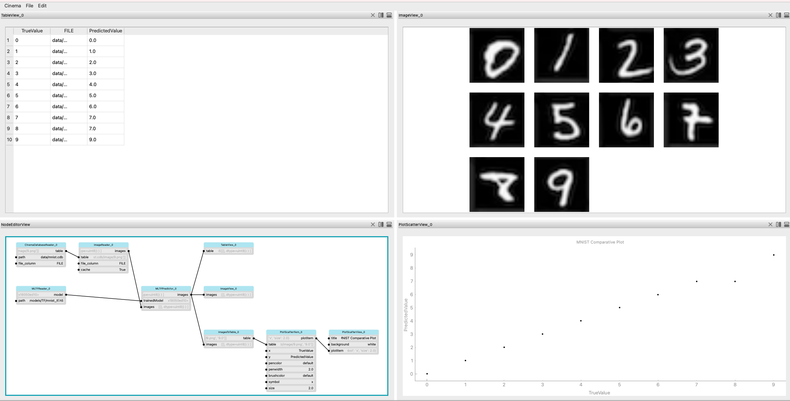

# ML Prediction

The `pycinema` framework allows the user to load a trained neural network, and given a set of images, predict the outcome of the neural network on each image. 

## Allowable Neural Network Formats

The framework currently supported neural networks built in Python using TensorFlow. Models must be saved in their entirity (structure and weights). TensorFlow currently has 3 formats by which a user can save the model. All three are acceptable:

- .keras (mymodel.keras)
- .h5 (mymodel.h5)
- SavedModel (directory MyModel/ with model-specific files)

## Components

There are two main components that allow the execution of this workflow. The MLTFReader reads the path to an TensorFlow model and loads it to memory. The MLTFPredictor takes as input the trained model and a set of Images, and makes the prediction from these inputs. The predicted value is saved as metadata 'PredictedValue' for each Image. 

### MLTFReader

Input:
- path to the model

Output:
- reference to the model

The model is loaded using Tensorflow's `load_model` function. 

### MLTFPredictor

Inputs:
- set of `pycinema` Images
- reference to the model

Output:
- set of `pycinema` Images with new metadata 

Image dimensions **must** be in the size required for the model. Currently, `pycinema` supports RGB images. If the network requires that the input image data is grayscale (numChannels = 1) it will convert the image to grayscale before sending it to the model. Image size and channel requirements are extracted from the model. All image data is normalized for consistency. 

## Example

An example of the MNIST dataset with trained TensorFlow models and sample images are included. This can be loaded from command line by running the command

```
cinema examples/theater/MLScatterPlot.py
```



The images are stored in a Cinema database located at data/mnist.cdb. The trained MNIST models are located at MNIST_models/TF/ . All three formats are available for use; the example above uses the `.h5` format. The `CinemaDatabaseReader` filter loads the images and related values from the Cinema Database. The true values for each MNIST image is recorded in the `data.csv` file. The `ImageReader` filter formats the table into the `pycinema` Image format. The `MLTFReader` filer loads the TensorFlow model. The `MLTFPredictor` filter takes both the model and Images and adds the predicted values to each Image metadata. The `ImagesToTable` filter formats the images into a structure the scatter plot can read. The `PlotScatterItem` filter identifies the parameters to plot for the x and y axes, as well as other plotting specifications. The `TableView`, `ImageView` and `PlotScatterView` filters display the data as a table, images and a scatter plot respectively. Note that for the image with True Value **8**, the Predicted Value is **7**. Looking at the corresponding image makes it clear that the skewed writing can easily be mistaken for a **7** instead of an **8**.
