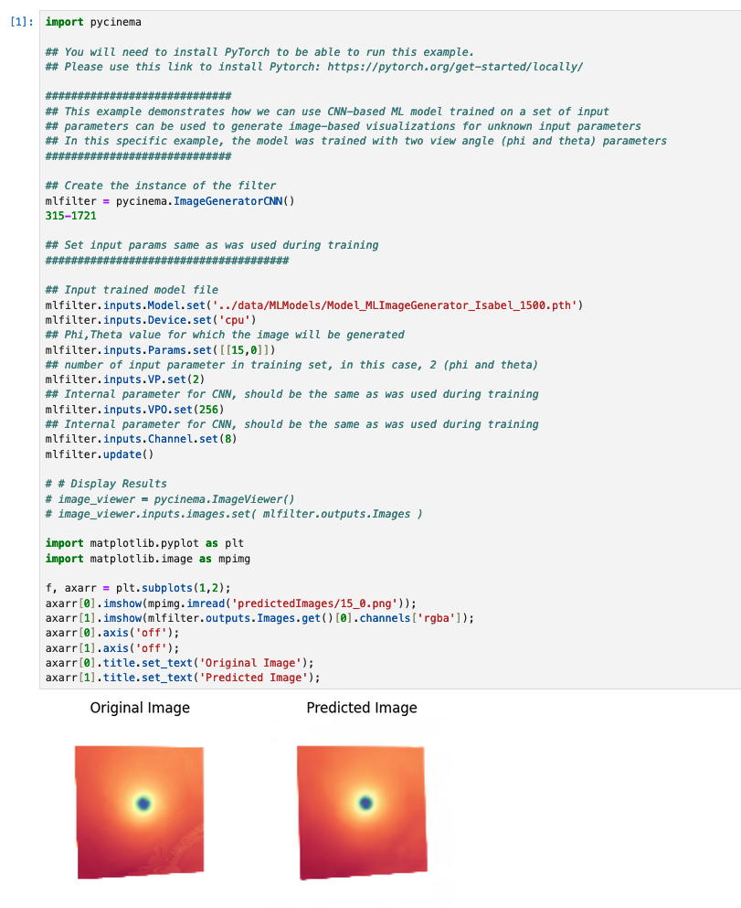
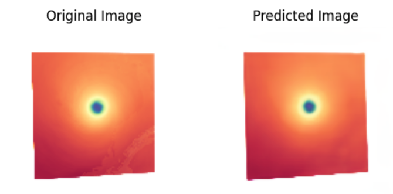

# Generating New Images in pycinema using Machine Learning

Over the past three to four years, view synthesis, the generation of new, unseen images of a scene, from a set of pre-existing images of the same scene, has gained popularity. Specifically in the machine learning community, the ability to train a neural network from a set of images and their corresponding locations, has allowed us to predict the view from new locations. The neural network is essentially overfit to the simulation (or sequence of simulation steps) at hand and therefore can make very accurate predictions of what the scene would look like from different angles and for subsequent time steps. The InSituNet<sup>[[1]](#1)</sup> and NeRF<sup>[[2]](#2)</sup> frameworks are examples of such work. 

## Generating new images from a trained network

Currently, the `pycinema` module supports new view generation for networks built on the InSituNet framework. Given `phi`, `theta` and optional `time` values for the new image, and a path to the trained network, the `ImageGeneratorCNN` module generates the new image at the specified view direction and time.


To generate an instance of the module, run:
```
mlfilter = pycinema.ImageGeneratorCNN()
``` 

Set the path to the trained network as below. 
```
mlfilter.inputs.Model.set('../path/to/neural/network.pth')
```

Parameters for the net view (in `phi` and `theta`) are defined as follows:
```
mlfilter.inputs.Params.set([[phi, theta]])
```

For example, we train a neural network based on the Hurricane Isabel dataset. This trained network is saved in `../data/MLModels/Model_MLImageGenerator_Isabel_1500.pth` for reference. 

We then generate a new image at `phi=15.0` and `theta=0.0`, as shown in `demoMLImageGenerator.ipynb`:



We can compare the Predicted Image to the Original Reference Image:



## References

<a id="1">[1]</a> 
He, W., Wang, J., Guo, H., Wang, K. C., Shen, H. W., Raj, M., ... & Peterka, T. (2019). InSituNet: Deep image synthesis for parameter space exploration of ensemble simulations. IEEE transactions on visualization and computer graphics, 26(1), 23-33.

<a id="2">[2]</a> 
Mildenhall, B., Srinivasan, P. P., Tancik, M., Barron, J. T., Ramamoorthi, R., & Ng, R. (2021). Nerf: Representing scenes as neural radiance fields for view synthesis. Communications of the ACM, 65(1), 99-106.