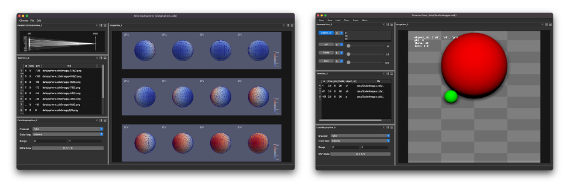

# Cinema Engine


Cinema v2.0 is a newly designed toolkit of python-based components for creating, filtering, transforming and viewing Cinema databases. There is more information about the Cinema project [here](https://cinemascience.github.io).

Cinema databases are a compact and interactive output format that can be created from scientific visualization tools and infrastructures (ParaView, Ascent, etc.) or created through other code by writing to the common output format. 

||
| ---- |
|*Screen capture of the pycinema UI, showing a composited image, view controls, table widget, and rendering controls.*|

# Working with the code and the `pycinema` module

## Installing and running with the pycinema module

```
python3 -m venv pcenv
source pcenv/bin/activate
pip install --upgrade pip
pip install . 
```

## Installing and running with the test pycinema module

```
python3 -m venv pcenv
source pcenv/bin/activate
pip install --upgrade pip
pip install -i https://test.pypi.org/simple/ --extra-index https://pypi.org/simple pycinema
```

# Creating a local python environment

To create a local python environment for this project, run the following commands within the repository directory:
```
python3 -m venv pcenv
source pcenv/bin/activate
pip install --upgrade pip
pip install .
```

# Running examples

You can now use this python environment to run examples from the repository. Run `cinema` and select a file from the `data` directory:

```
source pcenv/bin/activate
cinema view data/sphere.cdb
```

# Making and uploading the python module

```
make module
``` 

And then to upload it to `pypi` (assuming you have permission):

```
make module-upload
```

To upload it to `testpypi` (assuming you have permission):

```
make module-test-upload
```

# Related repositories

- ```pycinema-data``` example Cinema datasets.
- ```pycinema-testdata``` Cinema databases used for unit testing and CI testing.
- ```pycinema-binder``` binder online examples of Cinema databases and viewers. 

# Design proposals

- [CIS image proposal](doc/cis_proposal.md)

# Citing this work

- Cinema paper (2014): James Ahrens, Sébastien Jourdain, Patrick O'Leary, John Patchett, David H. Rogers, and Mark Petersen. *An image-based approach to extreme scale in situ visualization and analysis*. In Proceedings of the International Conference for High Performance Computing, Networking, Storage and Analysis (SC '14). IEEE Press, Piscataway, NJ, USA, 424-434, 2014. 
- ```pycinema``` (this toolkit): Cite this web page

# Contributing

Contributions can be made by submitting issues and contributing code through pull requests. The code shall be reviewed by the core Cinema team, and accepted when both content and code standards are met.
