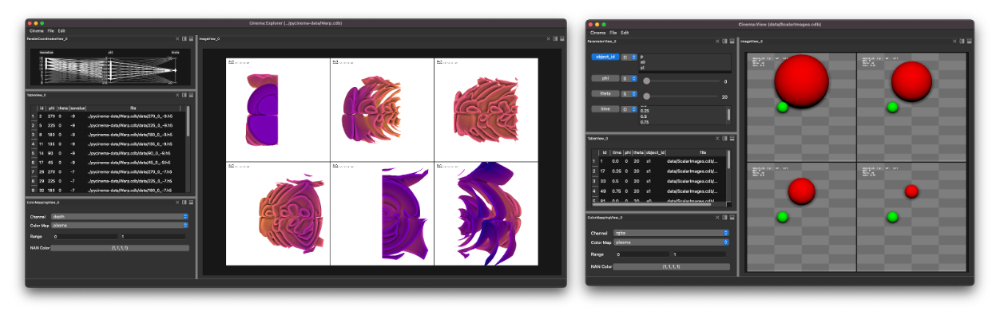

# Cinema Engine


`pycinema` is a toolkit of python-based components for creating, filtering, transforming and viewing Cinema databases. Cinema databases are a compact and interactive output format that can be created from scientific visualization tools and infrastructures (ParaView, Ascent, etc.) or created through other code by writing to the common output format. There is more information about the Cinema project [here](https://cinemascience.github.io).

Full documentation for this project can be found on [readthedocs.org](https://pycinema.readthedocs.org)

||
| ---- |
|*Screen capture of two pycinema Workflows, cinema:explorer and cinema:view, which mimic the functionality of existing viewers in Cinema (and add a few added features). Both of these are available in the pycinema toolkit.*|

## New concepts to Cinema: 'filter graphs' and 'workspaces'

This toolkit introduces the concept of *filter graphs* and *workspaces* to Cinema. Data operations (loading, querying, manipulating and viewing) are performed by *filters* that take input data, transform it, and pass it on in the form of tables, data, or data products. A collection of these *filters* is connected in a *filter graph*, and a *filter graph* can be saved in a reusable way known as a *workspace*. This makes the cinema toolkit a flexible platform for creating, modifying and saving data workflows.

||
| ---- |
|*Screen capture of Cinema:Explorer workspace, showing the normal view (left) and also revealing the 'filter graph' view (lower right) of the workspace. pycinema introduces both of these concepts to cinema data workflows.*|

# Working with the code and the `pycinema` module

- Installing and running with the pycinema repository:

```
git clone git@github.com:cinemascience/pycinema.git
cd pycinema
python3 -m venv pcenv
source pcenv/bin/activate
pip install --upgrade pip
pip install . 
```

- Installing and running with the released pycinema module

```
mkdir pyc-test
cd pyc-test
python3 -m venv pcenv
source pcenv/bin/activate
pip install --upgrade pip
pip install pycinema 
```

- Running examples

You can now use this python environment to run examples from the repository. Run `cinema` and select a file from the `data` directory:

```
source pcenv/bin/activate
cinema view data/sphere.cdb
```

# Making and uploading the python module

```
make module
``` 

And then to upload it to `pypi` (assuming you have permission):

```
make module-upload
```

To upload it to `testpypi` (assuming you have permission):

```
make module-test-upload
```

# Documentation

Documentation for this project can be found on [readthedocs.org](https://pycinema.readthedocs.org)

# Related repositories

- ```pycinema-data``` example Cinema datasets.
- ```pycinema-examples``` examples referenced in the [readthedocs site](https://pycinema.readthedocs.org)
- ```pycinema-testdata``` Cinema databases used for unit testing and CI testing.

# Citing this work

- Cinema paper (2014): James Ahrens, Sébastien Jourdain, Patrick O'Leary, John Patchett, David H. Rogers, and Mark Petersen. *An image-based approach to extreme scale in situ visualization and analysis*. In Proceedings of the International Conference for High Performance Computing, Networking, Storage and Analysis (SC '14). IEEE Press, Piscataway, NJ, USA, 424-434, 2014. 
- ```pycinema``` (this toolkit): Cite this web page

# Contributing

Contributions can be made by submitting issues and contributing code through pull requests. The code shall be reviewed by the core Cinema team, and accepted when both content and code standards are met.
